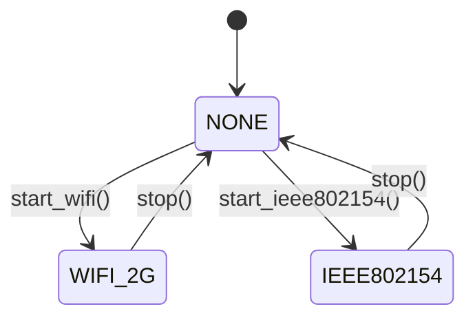

# poom_scanner_core

## Purpose
`poom_scanner_core` is a small “channel occupancy” scanner that hops radio channels and collects per-channel statistics into internal arrays (no UI).

It supports:
- Wi-Fi scanning using promiscuous RX.
  - ESP32-C6: 2.4 GHz (channels 1..13)
  - ESP32-C5: 2.4 GHz (1..13) + a curated set of common 5 GHz channels
- IEEE 802.15.4 (channels 11..26) for Zigbee/Matter using the `esp_ieee802154` driver.

## Responsibilities
- Own scan mode and radio resources (start/stop).
- Hop channels periodically using a FreeRTOS software timer.
- Count packets per channel and track RSSI (avg/max) per channel.
- Provide thread-safe snapshots of stats and “top channels” helpers.
- Fix Wi-Fi reception on a selected channel and expose one-second frame counters for the `WIFI AIR` view.
- Provide a single optional ISR consumer for IEEE 802.15.4 frames (e.g. PCAP capture) while the core owns the required global callback symbol.

## Directory Layout

```text
modules/poom_scanner_core/
├── CMakeLists.txt
├── README.md
├── poom_scanner_core.c
└── include/
    ├── poom_scanner_core.h
    └── poom_scanner_core_ieee802154_isr.h
```

## Public API Overview

From `include/poom_scanner_core.h`:
- `poom_scanner_core_reset_stats`
  - Clears internal counters (does not stop scanning).
- `poom_scanner_core_start_wifi(hop_ms)`
  - Starts Wi-Fi promiscuous scanning and channel hopping with `esp_wifi_set_channel()`.
- `poom_scanner_core_start_ieee802154(hop_ms)`
  - Starts IEEE 802.15.4 scanning and channel hopping with `esp_ieee802154_set_channel()`.
  - Packets are processed in `esp_ieee802154_receive_done()` to extract RSSI and update stats.
- `poom_scanner_core_stop`
  - Stops scanning and releases radio resources.
- `poom_scanner_core_get_mode`
  - Returns current mode (`NONE`, `WIFI_2G`, `IEEE802154`).
- `poom_scanner_core_get_wifi_stats(out)`
- `poom_scanner_core_get_ieee802154_stats(out)`
  - Thread-safe snapshots of internal arrays plus `current_channel` and `hop_ms`.
- `poom_scanner_core_get_wifi_top_channels(out_entries, out_len)`
- `poom_scanner_core_get_ieee802154_top_channels(out_entries, out_len)`
  - Returns the top N channels ordered by `packet_count` (descending), with `packet_pct` and RSSI stats.
- `poom_scanner_core_wifi_focus_channel(channel)` / `poom_scanner_core_wifi_resume_hopping()`
  - Pause the survey on one channel for analysis, then resume the same hopping timer.
- `poom_scanner_core_get_wifi_air_stats(out, reset_window)`
  - Snapshots Data, Management, Control, Retry, Deauth, RTS and CTS counters without storing captured frames.

From `include/poom_scanner_core_ieee802154_isr.h`:
- `poom_scanner_core_ieee802154_register_isr_consumer(cb, user)`
- `poom_scanner_core_ieee802154_unregister_isr_consumer(cb)`
  - Registers a single ISR-safe consumer invoked from `esp_ieee802154_receive_done()`.
  - Useful for other modules (e.g. `poom_pcap`) that need a copy of frames.

## Data Model (What the Stats Mean)
- `packet_count[ch]`: how many packets were observed on a channel since last `reset_stats()`.
- `rssi_avg_dbm[ch]`: average RSSI (dBm) for that channel (integer average).
- `rssi_max_dbm[ch]`: strongest RSSI (dBm) observed on that channel.
- For “top channels” helpers:
  - `packet_pct`: percentage of total packets attributed to that channel (0..100).

## Runtime Flow

```mermaid
flowchart TD
    A[poom_scanner_core_start_*] --> B[Init radio + configure RX]
    B --> C[Create/start FreeRTOS hop timer]
    C --> D[Timer tick]
    D --> E{Mode}
    E -->|Wi-Fi| F[esp_wifi_set_channel(next)]
    E -->|802.15.4| G[esp_ieee802154_set_channel(next)]
    G --> H[esp_ieee802154_receive()]
    F --> I[Wi-Fi promiscuous callback]
    I --> J[Update per-channel arrays]
    H --> K[esp_ieee802154_receive_done ISR]
    K --> L[Optional ISR consumer]
    K --> M[Update per-channel arrays]
    M --> N[receive_handle_done + receive]
    J --> O[poom_scanner_core_get_*_stats copies snapshot]
```

## State Machine



## Usage (Typical)

```c
#include "poom_scanner_core.h"

void start_scan(void)
{
    /* Hop every 200ms. */
    poom_scanner_core_start_wifi(200);
}

void poll_stats(void)
{
    poom_scanner_core_wifi_stats_t st;
    if(poom_scanner_core_get_wifi_stats(&st))
    {
        /* st.channels[i] tells you which channel packet_count[i] refers to. */
    }
}

void stop_scan(void)
{
    poom_scanner_core_stop();
}
```

## Notes / Limitations
- Wi-Fi scanning is 2.4 GHz only on targets without 5 GHz support.
- `WIFI AIR` reports observed frame activity rather than exact RF airtime; undecodable Wi-Fi and non-Wi-Fi interference are outside these counters.
- Its small runtime counter block is allocated with `malloc`, verified as internal memory, and released by `poom_scanner_core_stop()`.
- IEEE 802.15.4 scanning is only enabled on targets that support `esp_ieee802154` in this firmware (guarded by target macros in the implementation).
- The module intentionally does **no rendering/UI**; menus should consume stats via the snapshot APIs.
